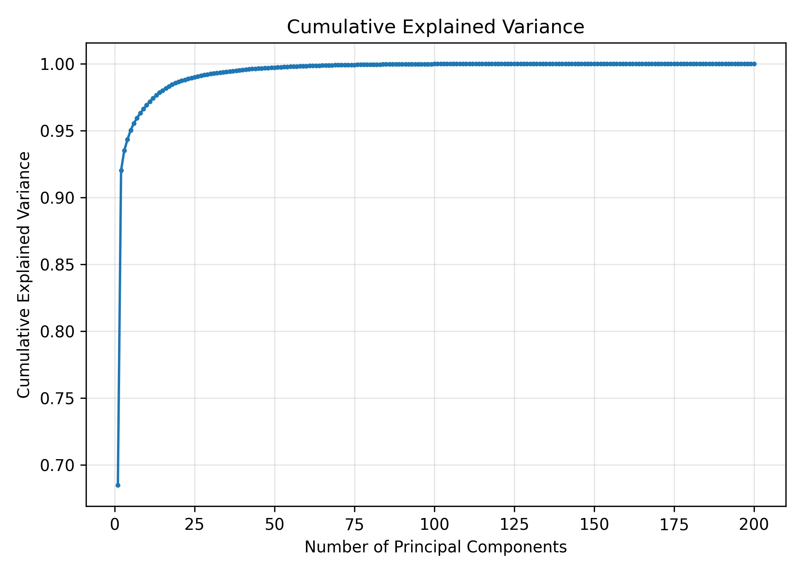
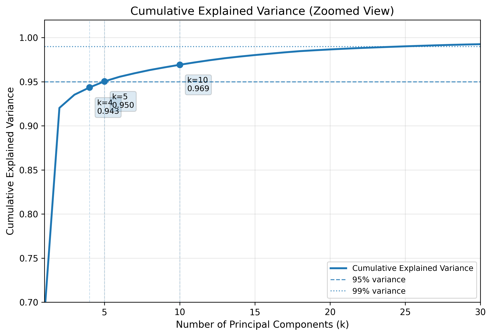
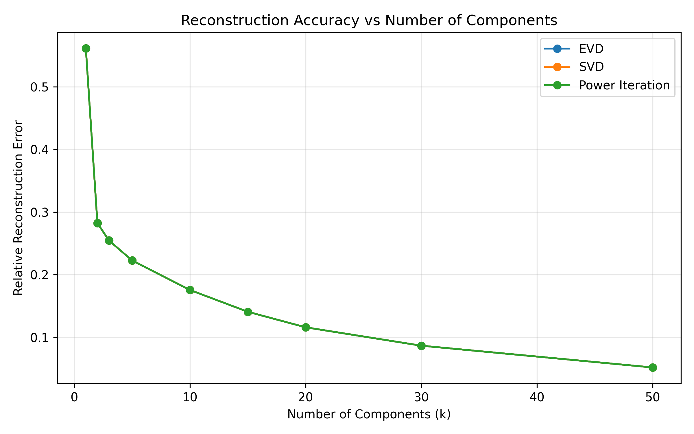
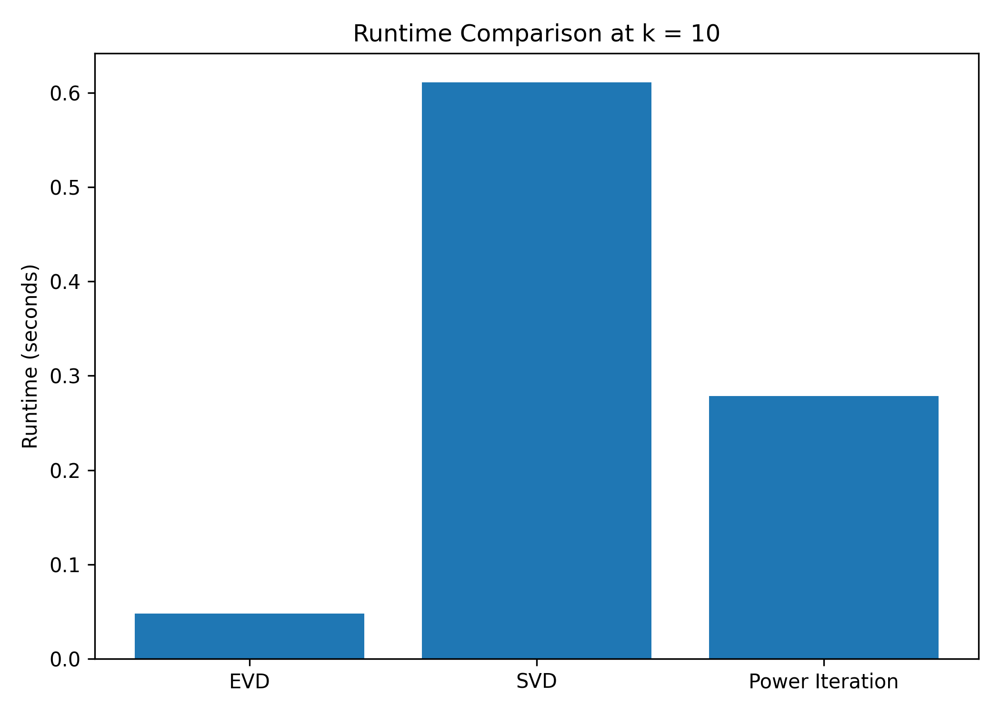
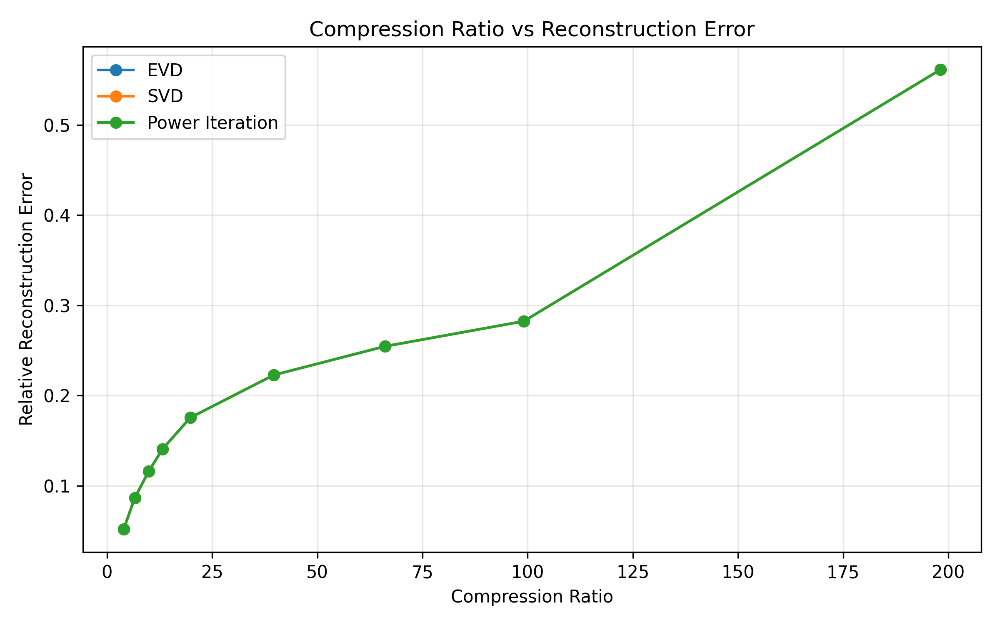
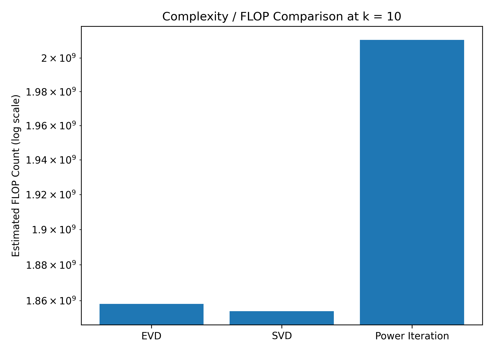
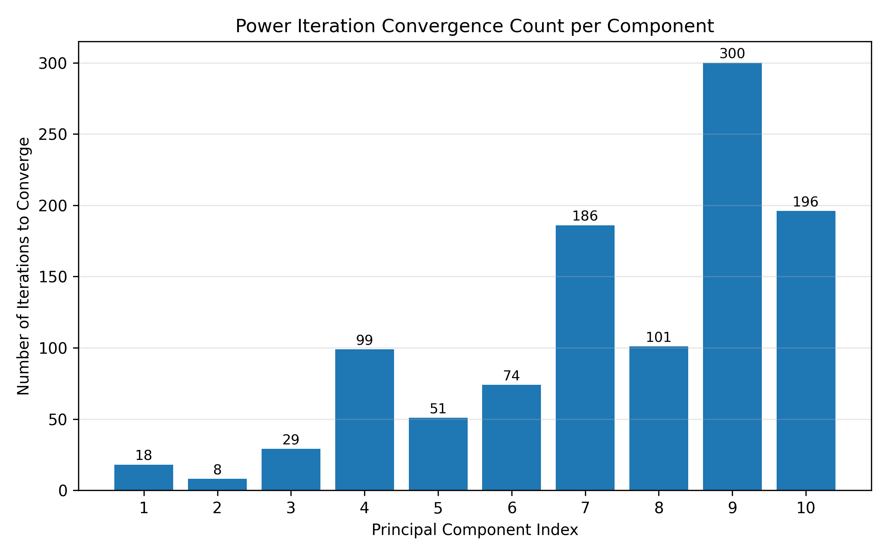
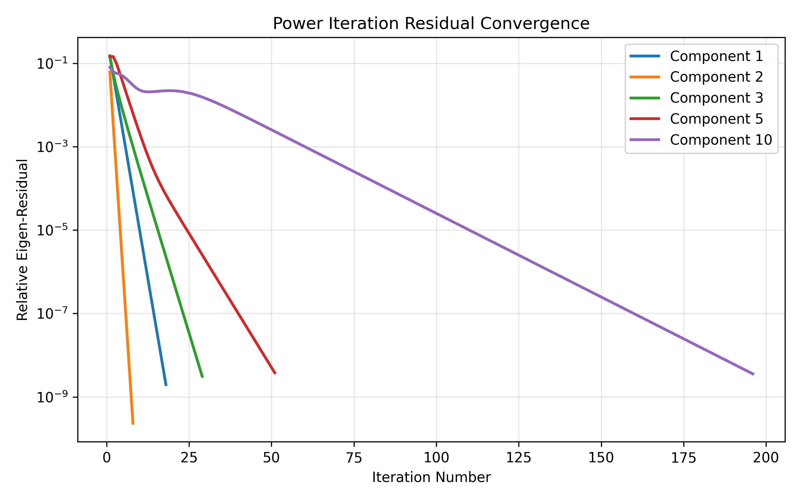
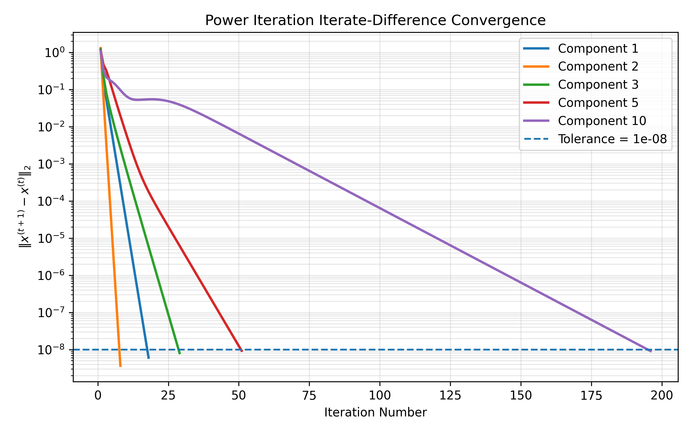
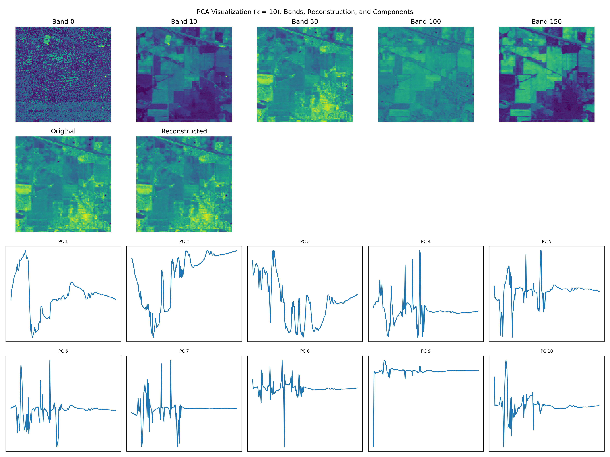

# PCA Hyperspectral Analysis — Figures

This directory contains the figures generated from the PCA-based hyperspectral analysis.

The experiments compare Eigenvalue Decomposition (EVD), Singular Value Decomposition (SVD), and Power Iteration in terms of reconstruction quality, runtime, compression, computational complexity, and convergence behavior.

---

## Cumulative Explained Variance

The cumulative explained variance rises rapidly as the number of principal components increases.

The first few principal components capture most of the variance in the hyperspectral data, showing that PCA can significantly reduce dimensionality while preserving most of the information in the original dataset.

---

## Cumulative Explained Variance — Zoomed View

The zoomed view highlights the variance captured by the first principal components.

Approximately:

- `k = 4` captures about `94.3%` of the variance.
- `k = 5` captures about `95.0%` of the variance.
- `k = 10` captures about `96.9%` of the variance.

This shows that a relatively small number of components is sufficient to preserve a large fraction of the original spectral information.

---

## Figure 1 — Reconstruction Error vs. Number of Components

The relative reconstruction error decreases as the number of retained principal components increases.

EVD, SVD, and Power Iteration produce nearly identical reconstruction-error curves, indicating that all three methods recover essentially the same PCA subspace for the tested values of `k`.

With only a few components, reconstruction error is relatively high, while using more components progressively improves reconstruction quality.

---

## Figure 2 — Runtime Comparison

This figure compares the measured runtime of EVD, SVD, and Power Iteration at `k = 10`.

For this experiment:

- EVD has the lowest measured runtime.
- Power Iteration is slower than EVD.
- SVD has the highest measured runtime.

Although the three approaches achieve nearly identical reconstruction quality, their execution times differ substantially.

---

## Figure 3 — Compression Ratio vs. Reconstruction Error

This figure illustrates the trade-off between compression and reconstruction quality.

Higher compression ratios correspond to larger reconstruction errors because fewer principal components are retained.

As more components are preserved, the compression ratio decreases while reconstruction accuracy improves.

The curves for EVD, SVD, and Power Iteration overlap closely, showing that their reconstruction behavior is effectively equivalent for the tested settings.

---

## Figure 4 — Computational Complexity / FLOP Comparison

This figure compares the estimated floating-point operation count for EVD, SVD, and Power Iteration at `k = 10`.

EVD and SVD have similar estimated computational costs, while Power Iteration has a somewhat larger estimated FLOP count in this experiment.

This comparison shows that similar reconstruction accuracy does not necessarily imply identical computational cost.

---

## Figure 5 — Power Iteration Convergence Count per Component

This figure shows the number of iterations required for each of the first ten principal components to converge when using Power Iteration.

The convergence speed varies considerably across components.

For example:

- Component 2 converges very quickly.
- Components 1 and 3 also converge in relatively few iterations.
- Later components generally require more iterations.
- Component 9 reaches the maximum iteration count of 300 in this experiment.

This behavior occurs because convergence depends strongly on the separation between neighboring eigenvalues.

---

## Figure 6 — Power Iteration Residual Convergence

The residual convergence plot tracks the relative eigen-residual for selected principal components over successive iterations.

Components associated with dominant and well-separated eigenvalues converge rapidly.

Later components converge more slowly because the corresponding eigenvalues are typically closer together, making them more difficult to isolate through iterative updates.

The logarithmic vertical scale makes it possible to observe convergence over several orders of magnitude.

---

## Figure 7 — Power Iteration Iterate-Difference Convergence

This figure tracks the norm of the difference between consecutive Power Iteration estimates,

`||x^(t+1) - x^(t)||₂`,

for selected principal components.

The dashed horizontal line represents the convergence tolerance of `1e-8`.

Components 1, 2, and 3 converge relatively quickly, while Components 5 and 10 require substantially more iterations.

The tenth component converges particularly slowly, illustrating how Power Iteration performance can degrade for components associated with smaller or closely spaced eigenvalues.

---

## PCA Reconstruction and Principal Component Visualization

This visualization presents several aspects of the PCA decomposition using `k = 10`.

The top row shows selected hyperspectral bands, demonstrating how spatial structure changes across wavelengths.

The second row compares an original band with its PCA-based reconstruction.

The reconstructed image remains visually similar to the original, indicating that ten principal components preserve much of the important spatial information.

The lower panels show the first ten principal-component loading profiles across the spectral dimension.

Earlier principal components capture broad spectral structure, while later components contain increasingly localized or higher-frequency variation.

---

## Summary

The figures demonstrate several important properties of PCA-based hyperspectral dimensionality reduction:

- A small number of principal components captures most of the total variance.
- Around five components capture approximately 95% of the variance.
- Ten components capture roughly 97% of the variance.
- Reconstruction error decreases as more principal components are retained.
- EVD, SVD, and Power Iteration provide nearly identical reconstruction quality.
- Their runtime and computational cost differ substantially.
- Higher compression produces greater reconstruction error.
- Power Iteration convergence becomes slower for some higher-order principal components.
- The PCA reconstruction preserves much of the spatial structure of the original hyperspectral data even when using a reduced number of components.
